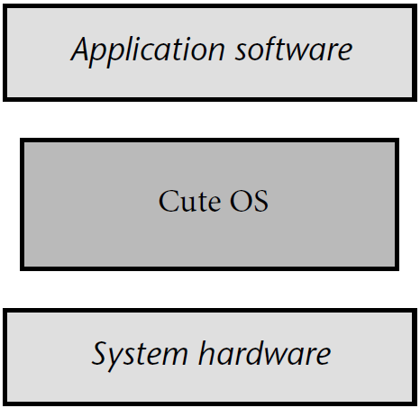
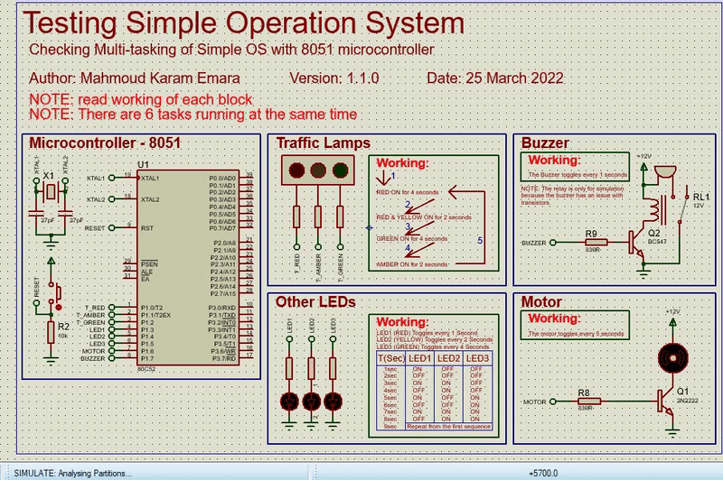
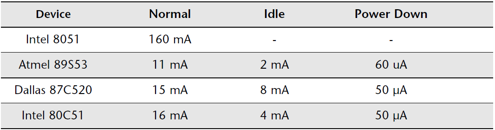
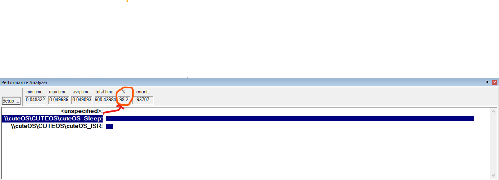

<h1 align="center">Cute OS</h1>

      

<p align="center">
  
</p>

✅ Perform a review and leave a comment <a href="https://github.com/makaram99/cute-os/issues/1">here</a></strong>

✅ If you want to contribute, add a new record like <a href="contributing.md">here</a>. This example is for my [Tank Level Control](https://github.com/makaram99/tank-level-control) project, but the idea is the same for any project.

✅ If this needs to be improved, create an issue <a href="https://github.com/makaram99/cute-os/issues">here</a></strong>

---

## 🔑 Introduction

This is a simple real time operating system for embedded systems, especially for **8051 (8-bit) microcontroller**.
It can be used with multi-states applications to run different tasks at the same time.

By using this OS, you can:

* Schedule a task with the frequency of your choice.
* Remove any existed task.
* The OS is isolated from the application:
    <p align="center">
    
    </p>

The project is **open source** and you can use it for your own projects.

You can test it **without any Hardware**, it can be simulated as will be discussed in the next sections. So, you don't need any hardware to run this operating system.

## Table of Contents

- [🔑 Introduction](#-introduction)
- [Table of Contents](#table-of-contents)
- [🛠️ Development Tools Required](#️-development-tools-required)
- [Project Hierarchy](#project-hierarchy)
  - [Directories](#directories)
  - [Files](#files)
- [⚙ Working](#-working)
  - [System Behaviour](#system-behaviour)
  - [Code](#code)
  - [Simulation](#simulation)
- [🎯 Results](#-results)
- [📑 Generate Documentation](#-generate-documentation)
- [🔬 What is next?](#-what-is-next)
- [💁‍♂️ Contribute](#️-contribute)
- [📞 Contact me](#-contact-me)
- [📖 References](#-references)
- [🔓 Licenses](#-licenses)
- [🔏 Credits](#-credits)

---

## 🛠️ Development Tools Required

Read this [guide](https://github.com/makaram99/8051-projects/blob/master/tools.md) to know what tools are required to develop this project.

---

## Project Hierarchy

The project contains some files and directories:

### Directories

* **[code](code/)**: Contains the code implemented using VS Code and Keil-uVision5.
* **[docs](docs/)**: Contains the documentation files generated by doxygen and make, and others.
* **[simulation](simulation/)**: Contains the simulation files of Proteus8.9.

### Files

* **[README.md](README.md)**: The description of the project (What you are reading now).
* **[LICENSE](LICENSE)**: The license description of the project.
* **[Doxyfile](Doxyfile)**: The configuration of doxygen application (Documentation generator).
* **[doxygen.mk](doxygen.mk)**: Contains the configuration and rules to be run using make to generate documents.
* **[tools.md](tools.md)**: Contains HOW-TO-SETUP the tools required to run this project.
* **[version_log.md](version_log.md)**: Contains the history of the project.

---

## ⚙ Working

### System Behaviour

The Systems has 4 blocks, with overall of 6 tasks. These blocks are:

1. Traffic Lights: This block has only one task (```TRAFFIC_Update```).
   And it runs every second.
   The working of this block is shown in the following figure:
   
2. LEDs: This block has 3 tasks, one task for each LED (```led1_toggle, led2_toggle, led3_toggle```).
   The working of this block is shown in the following figure:
   
3. Motor: This block has only one task (```motor_toggle```).
   The working of this block is shown in the following figure:
   
4. Buzzer: This block has only one task (```buzzer_toggle```).
   The working of this block is shown in the following figure:
   

### Code

To develop the project, you need to:

* YOU MUST HAVE **Keil-uVision5** installed on your computer.
* Open the **code** directory.
* Click twice on **[cuteOS.uvproj](code/cuteOS.uvproj)** file.
* It will open with Keil-uVision5.
* Enjoy the development.
* You can build the project by clicking on **F7** key on keyboard.
NOTE: The scheduler is the function called **cuteOS_ISR** which is periodically to run new tasks.

**NOTE**: The scheduler is the function called ```cuteOS_ISR``` which is executed periodically to check whether to run new tasks or not.

**NOTE**: I've documented the code as much as I can. So, I hope you will understand the code.

### Simulation

To simulate the project, you need to:

* YOU MUST HAVE **Proteus8.9** installed on your computer.
* Proteus8.9 has **compatibility issues** with its version, and the project may not be opened if you have a different version of Proteus8.9. So, you need to install **Proteus8.9 8.9** to be able to simulate the project.
* Open the [simulation](simulation/) directory.
* Click twice on [simulation.pdsprj](simulation/simulation.pdsprj) file.
* It will open with Proteus8.9.
* The simulation works as the following:
    
* Enjoy the simulation.
* To stop the simulation: Press twice on **ESC** key from the keyboard.

**NOTE**: I've disabled the **buzzer task** as you will see in the code (in [main.c](code/src/main.c) file). If you want to use the buzzer, you can enable it by:

1. In main function in [main.c](code/src/main.c) file, comment the line:

   ```cuteOS_TaskRemove(buzzer_toggle);```  
   --> ```/*cuteOS_TaskRemove(buzzer_toggle);*/```
2. Build the project from Keil-uVision5 by pressing on **F7** key on keyboard.
3. Run the simulation in Proteus8.9.
4. If you have Dell PC, Enjoy the sound of damn.

---

## 🎯 Results

After running the simulator on Keil-uVision5, the power consumption of the CPU decreased from **55mW** to **10.81mW**. This is because:

1. Current consumption of the CPU of each mode is:
    
2. Assuming we use Atmel 89S53 device (version of 8051 microcontroller manufactured by ATmel), the current consumption of the CPU is:
    * Idle mode: **2 mA**
    * Normal mode: **11 mA**
3. After simulating the code using uVision simulator, and profiling the execution time of function, the result is shown here:
    
4. So, the power consumption can be calculated as follow:
    * The 8051 microcontroller uses 5V Logic level.
    * The average current consumption of the CPU is:
      1. <u>Without cute OS</u>: the code is always running in **normal mode** and the current consumption is **11mA**.
      2. <u>With cute OS</u>: As shown in the above image, the code is running in:
          * **idle mode** (<u>cuteOS_Sleep</u> function runs for 98.2% of the time.), and
          * **normal mode** (<u>cuteOS_ISR</u> function runs for 1.8% of the time.).  
      3. So, the **average current** consumption is:  ```(11mA * 1.8% + 2mA * 98.2%) / 100 = 2.162mA```.
    * The power consumption of the CPU is:
      1. Without the OS: ```11mA * 5V = 55mW```
      2. With the OS: ```2.162mA * 5V = 10.81mW```

---

## 📑 Generate Documentation

To generate documentation:

1. YOU MUST HAVE **DOXYGEN** AND **MAKE** INSTALLED ON YOUR COMPUTER.
2. From the home directory of the project ([cuteOS](./)), open the command prompt in your OS (**cmd** for Windows, **bash** for linux, ...)
3. Run the following command:
   ```make -f doxygen.mk all```
4. The documentation will be generated in the **[docs](docs)** directory.

**NOTE**: the file doxygen.mk is configured to run on Windows OS. If you want to run it on Linux OS, you need to change the configurations by opening the file and search for the section:

   ```ENVIRONMENT VARIABLES```

   and change each variable value depending on the OS you are using.
   Options are given in the comment before each variable.
   For example, to change the Shell name:

   ``` makefile
   # Shell of the OS, Options are: bash for Linux, sh for MacOS, cmd for Windows
    SHELL = cmd
   ```

Options for shell are:

* **bash** for Linux
* **sh** for MacOS
* **cmd** for Windows

---

## 🔬 What is next?

I will always try to improve this project
So, if you have any suggestion, contact me and I will appreciate it.

---

## 💁‍♂️ Contribute

If you want to contribute to the project, you can:

1. Fork the project on your GitHub account.
2. Develop the project on your own.
3. Send a pull request to the project on GitHub.
4. I will review your pull request and add it to the project.

---

## 📞 Contact me

<p><a href="https://www.linkedin.com/in/makaram99" target="_blank"></a> <a href="mailto:ma.karam272@gmail.com" target="_blank"></a> </p>

## 📖 References

* Embedded C book by: **M.j. Pont**

## 🔓 Licenses

<a rel="license" href="http://creativecommons.org/licenses/by-sa/4.0/"></a><br />All DOCUMENTS inside this work is licensed under a <a rel="license" href="http://creativecommons.org/licenses/by-sa/4.0/">Creative Commons Attribution-ShareAlike 4.0 International License</a>.

All SOURCE codes & BINARIES are licensed under Mit License.

<p align="center">
  

</p>

<p align="center">
  

</p>

---

## 🔏 Credits

All credits and external sources are listed inside the page and inside this repo, references themselves.
