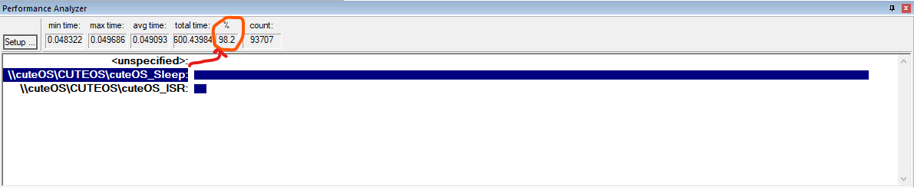

<p align="center">
  
</p>
<h1 align="center">Cute OS</h1>

---
## Introduction
This is a simple operating system for embedded systems. It is simple and easy to use operating system for embedded systems for **8051 (8-bit) microcontroller**.

I've created this operating system while learning, and to use for **8051 (8-bit) microcontroller** projects.

It is **Hardware free**, it can be simulated as will be discussed in the next sections. So, you don't need any hardware to run this operating system.

The project is **open source** and you can use it for your own projects.

---
## Features
It has following features:
* **Task Scheduling** (Round-Robin) with **Timer2 (16-bits)**
* Remove Tasks from the system

---
## Development Tools Required
All of the used tools are **open source** and can be used for your own projects. Except **Proteus**, which is a **closed source** tool. You need to purchase **Proteus** to use it.
* **Toolchain**: <u>uVision Keil C51 Compiler (C51)</u> 
  uVision Keil is used for code development, debugging, compiling, and simulating the system. It has a free version with limited features such as code size cannot exceed 2 KB.
  Download: [https://www.keil.com/c51/](https://www.keil.com/c51/)
* **Text Editor**: <u>Visual Studio Code</u> 
  VS Code is used for code development the system. It is **free**.
  Download: [https://code.visualstudio.com/](https://code.visualstudio.com/)
* **Hardware Simulator**: <u>Proteus 8.9</u> 
  Proteus is used to simulate the hardware. So, no need to purchase any hardware.
  Download: [https://www.proteus.co.jp/](https://www.proteus.co.jp/)
* **Documents Generator**: <u>doxygen</u> 
  Doxygen is used to generate documentations of the code in html, latex, pdf, and other formats.
  Download: [https://www.doxygen.nl/download.html](https://www.doxygen.nl/download.html)
* **Command Line Automation Tool**: <u>make</u> 
  Make is used to automate kernel commands. 
  I've used it to automate the generation of documents from doxygen.
  Download: 
  * Linux or MacOS: [https://www.gnu.org/software/make/](https://www.gnu.org/software/make/)
  * Windows: [http://gnuwin32.sourceforge.net/packages/make.htm](http://gnuwin32.sourceforge.net/packages/make.htm)
---
## Project Hierarchy
The project contains some files and folders:
#### Directories:
  * **[code](code/)**: Contains the code implemented using VS Code and uVision Keil.
  * **[docs](docs/)**: Contains the documentation generated using doxygen and make.
  * **[simulation](simulation/)**: Contains the simulation files of Proteus.
#### Files:
  * **[README.md](README.md)**: Contains the introduction of the project (What you are reading now).
  * **[LICENSE](LICENSE)**: Contains the license of the project.
  * **[Doxyfile](Doxyfile)**: Contains the configuration of doxygen (Documentation generator).
  * **[doxygen.mk](doxygen.mk)**: Contains the configuration and rules to be run using make to generate documents.
---
## Working 
#### Code
To develop the project, you need to:
* YOU MUST HAVE **uVision Keil** installed on your computer.
* Open the **code** directory.
* Click twice on **[cuteOS.uvproj](code/cuteOS.uvproj)** file.
* It will open with uVision Keil.
* Enjoy the development.
* You can build the project by clicking on **F7** key on keyboard.

**NOTE**: I've documented the code as much as I can. So, I hope you will understand the code.

#### Simulate
To simulate the project, you need to:
  * YOU MUST HAVE **Proteus** installed on your computer.
  * Proteus has **compatibility issues** with its version, and the project may not be opened if you have a different version of proteus. So, you need to install **Proteus 8.9** to be able to simulate the project.
  * Open the **simulation** directory.
  * Click twice on **[simulation.pdsprj](simulation/simulation.pdsprj)** file.
  * It will open with Proteus as shown here:

  * As shown in the image, the projects is divided into blocks such as Traffic Lights, Buzzer, and Motor blocks, each block is a **task**, except the Microcontroller block.
  * Before simulation, read the **Working** section of each block to know how the simulation will work  * To run simulation, click on **F12** from the keyboard.
  * Enjoy the simulation.
  * To stop the simulation: Press twice on **ESC** key from the keyboard.

**NOTE**: I've disabled the **buzzer task** as you will see in the code (in [main.c](code/src/main.c) file). If you want to use the buzzer, you can enable it by:
1. In main function in [main.c](code/src/main.c) file, comment the line:
   ```cuteOS_TaskRemove(buzzer_toggle);```
   The line after comment will be:
   ```/* cuteOS_TaskRemove(buzzer_toggle); */```
2. Build the project from uVision Keil by pressing on **F7** key on keyboard.
3. Run the simulation in Proteus.
4. If you have Dell PC, Enjoy the sound of damn.
---
## Generate Documentation
To generate documentation:
1. YOU MUST HAVE **DOXYGEN** AND **MAKE** INSTALLED ON YOUR COMPUTER.
2. From the home directory of the project (**cuteOS**), open the command prompt in your OS (**cmd** for Windows, **bash** for linux, ...)
3. Run the following command:
   ```make -f doxygen.mk all```
4. The documentation will be generated in the **[docs](docs)** directory.
---
## Results
After running the simulator on uVision Keil, the power consumption of the CPU decreased from **55 mW** to **10.81 mW**. This is because:
1. Current consumption of the CPU of each mode is:
  
2. Assuming we use Atmel 89S53 device (version of 8051 microcontroller manufactured by ATmel), the current consumption of the CPU is:
   * Idle mode: **2 mA**
   * Normal mode: **11 mA**
3. After simulating the code using uVision simulator, and profiling the execution time of function, the result is shown here:
  
4. So, the power consumption can be calculated as follow:
   * The 8051 microcontroller uses 5V Logic level.
   * The average current consumption of the CPU is:
      1. <u>Without the OS</u>: the code is always running in **normal mode** and the current consumption is **11 mA**.
      2.  <u>With the OS</u>: As shown in the above image, the code is running in:
          * **idle mode** (<u>cuteOS_Sleep</u> function runs for 98.2% of the time.), and
          * **normal mode** (<u>cuteOS_ISR</u> function runs for 1.8% of the time.) 
        
      3. So, the **average current** consumption is:
      ```(11 mA * 1.8% + 2mA * 98.2%) / 100 = 2.162 mA```.
   * The power consumption of the CPU is:
      1. Without the OS: 
        ```11 mA * 5V = 55 mW```
      2. With the OS:
        ```2.162 mA * 5V = 10.81 mW```
---
## Contributing
If you want to contribute to the project, you can:
1. Fork the project on your GitHub account.
2. Develop the project on your own.
3. Send a pull request to the project on GitHub.
4. I will review your pull request and add it to the project.
---
## What in next?
I will always try to improve this project.
So, if you have any suggestion, contact me and I will appreciate it.

## Contact me
<p><a href="https://www.linkedin.com/in/makaram99" target="_blank"></a> <a href="mailto:ma.karam272@gmail.com" target="_blank"></a> </p>

## References
* Embedded C book by: **M.j. Pont**


## License
This project is licensed under the MIT license. You can read the license in the [LICENSE](LICENSE) file.